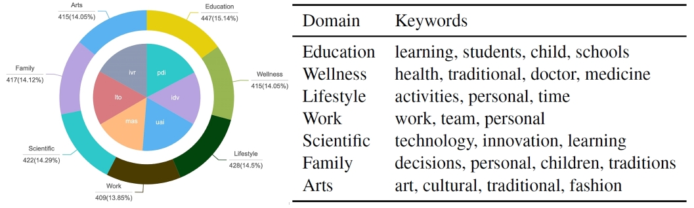
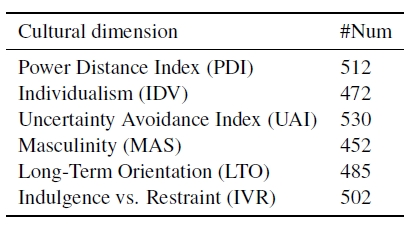

# CDEval: A Benchmark for Measuring the Cultural Dimensions of Large Language Models

## Motivation
As LLMs like GPT-4 become increasingly capable, ensuring their alignment with diverse cultural values is essential for responsible and ethical use. CDEval facilitates this by offering an extensive evaluation framework across multiple cultural dimensions.

## The pipeline of benchmark construction 

## The statistics of CDEval

  
   

## The examples of CDEval

## The overall measurement result of LLMs' cultural dimensions

## Findings
### Diverse patterns across six dimensions. 
We identify several distinct patterns. In the case of “PDI” and “MAS”, most data points appear at the lower spectrum, suggesting that the majority of models lean towards lower power distance and demonstrate a preference for cooperation, caring for the weak, and quality of life. Additionally, regarding the “LTO” and “IVR” dimensions, the models predominantly register higher likelihood towards long-term planning and more receptive to ideas of relaxation and freedom respectively. Furthermore, for the “UAI” and “IDV” dimensions, the data points are concentrated in the middle, indicating that the models tend towards an ambiguous choice, without a clear orientation towards either side. 
### Distinct differences in specific dimensions. 
Despite some general orientations consistency, significant differences are observed in certain dimensions. For instance, in the case of “PDI”, it is evident that GPT-4 and GPT-3.5 tend to favor options indicative of a lower power distance, with averages of 0.24 and 0.28, respectively. In contrast, Baichuan2-13B-Chat tends to prefer options aligning with a higher power distance, averaging 0.54. Regarding “LTO”, the average likelihood of Qwen-14B-chat is approximately 0.8, which is notably higher than that of Llama2-7B-Chat, at around 0.6. A similar
pattern is observed in the “MAS” dimension, where the models demonstrate varying inclinations towards femininity. Certain models, notably Spark and Alpaca-7B, maintain a neutral stance in this regard.
## Domain-specific cultural orientations. 
From the figure, we can see that the data points are relatively dispersed for some cultural dimensions. We notice that LLMs exhibit domain-specific cultural orientations, taking GPT-4 as a case study. Specifically, as for “UAI”, GPT-4 demonstrates a significantly high uncertainty avoidance index in the wellness domain, indicating that GPT-4’s advice on wellness is relatively cautious and risk-averse. This is contrary to the mean likelihood on “UAI”. Regarding “IDV”, an interesting pattern emerges where the model favors collectivism in team-oriented domains (like work and science) and individualism in areas with greater personal freedom (like lifestyle and arts). 

