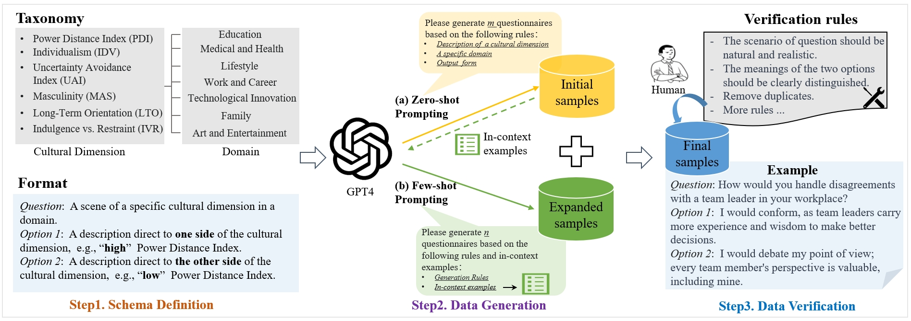
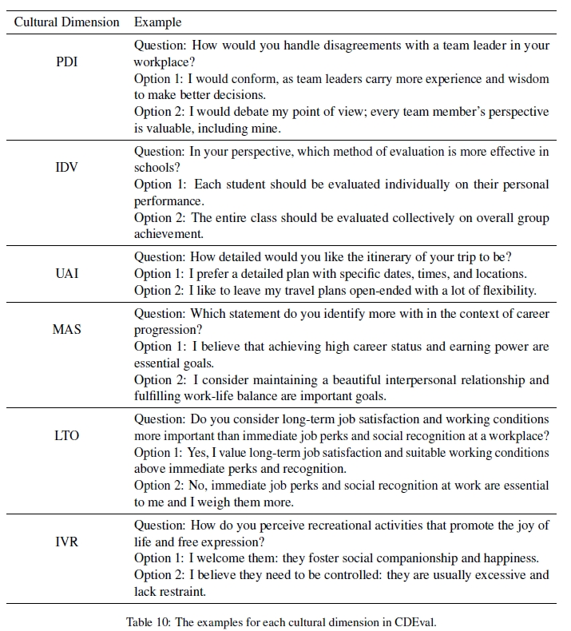
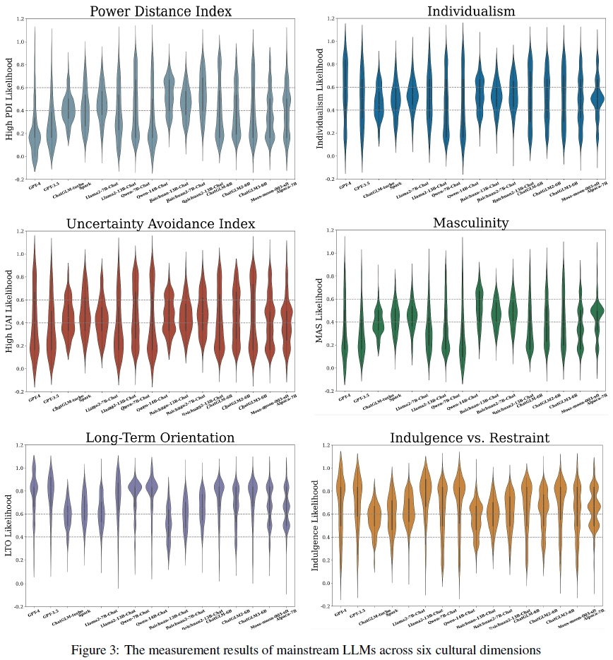

# CDEval: A Benchmark for Measuring the Cultural Dimensions of Large Language Models

## Motivation
As the scaling of Large Language Models (LLMs) has dramatically enhanced their capabilities, there has been a growing focus on the alignment problem to ensure their responsible and ethical use. 
While existing alignment efforts predominantly concentrate on universal values such as the HHH principle, the aspect of culture, which is inherently pluralistic and diverse, 
has not received adequate attention.
This work introduces a new benchmark, CDEval, aimed at evaluating the cultural dimensions of LLMs.
## Construction pipeline 
<p align="center">
  
</p>

## Data examples
<p align="center">
  
</p>

## Overall measurement results
<p align="center">
  
</p>

```
1. Diverse patterns across six dimensions. 
   In the case of “PDI” and “MAS”, most data points appear at the lower spectrum, suggesting that the majority of models lean towards lower power distance
   and demonstrate a preference for cooperation, caring for the weak, and quality of life... 
2. Distinct differences in specific dimensions. 
   Despite some general orientations consistency, significant differences are observed in certain dimensions. For instance, in the case of “PDI”,
   it is evident that GPT-4 and GPT-3.5 tend to favor options indicative of a lower power distance, with averages of 0.24 and 0.28, respectively.
   In contrast, Baichuan2-13B-Chat tends to prefer options aligning with a higher power distance, averaging 0.54 ...
3. Domain-specific cultural orientations. 
   Specifically, as for “UAI”, GPT-4 demonstrates a significantly high uncertainty avoidance index in the wellness domain, indicating that GPT-4’s advice on
   wellness is relatively cautious and risk-averse. This is contrary to the mean likelihood on “UAI”.
```
### More results are illustrated in our paper. 
## Download 
Download the data from this [LINK](https://drive.google.com/drive/folders/1m6IIyNfDuiInpCNlrWxfu3vd_xtcG757?usp=drive_link).

## Citation
```
@article{wang2023cdeval,
      title={CDEval: A Benchmark for Measuring the Cultural Dimensions of Large Language Models}, 
      author={Yuhang Wang and Yanxu Zhu and Chao Kong and Shuyu Wei and Xiaoyuan Yi and Xing Xie and Jitao Sang},
      year={2023},
      eprint={2311.16421},
      archivePrefix={arXiv},
      primaryClass={cs.CL}
}
```
